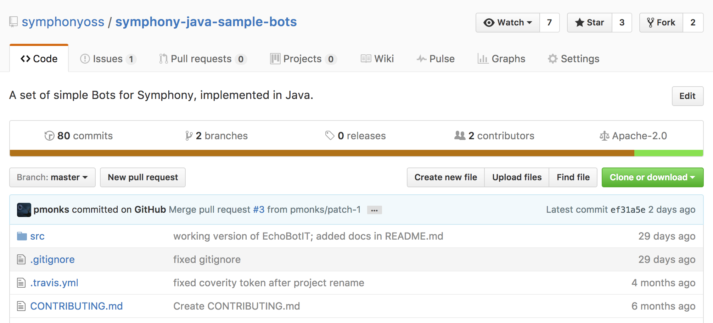
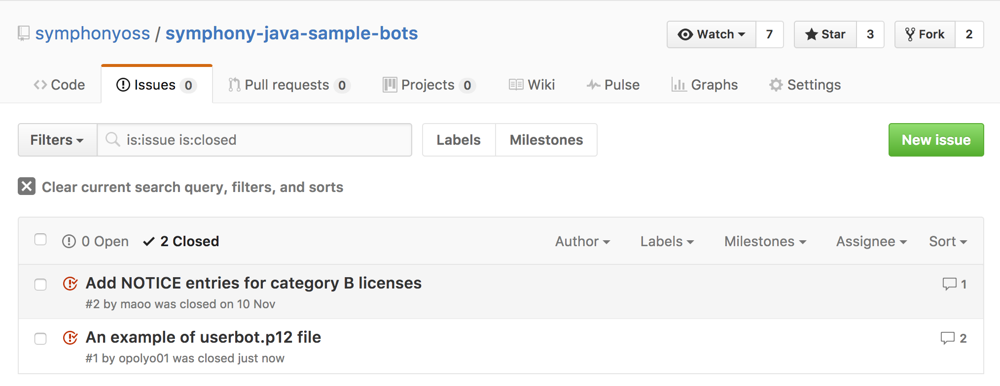

The Symphony Software Foundation provides a service-based infrastructure to support committers throughout the entire project lifecycle.

This page helps project leads (or any other project member) to setup a project pipeline for software development following the team's preferences and leveraging the infrastructure provided by the Foundation.

## Contribution

When the [code transfer](https://symphonyoss.atlassian.net/wiki/spaces/FM/pages/62783509/Contribution#Contribution-CodeTransfer) is completed, a new project will be publicly hosted in the [Foundation’s Github Organisation](https://github.com/symphonyoss), granting **write access** to project team members.

To know more about Github, you can browse through their list of guides.

### Issue tracking

Managing issues (or tickets) across a team is a very important project activity, especially at the beginning; the Foundation strongly advises to choose and setup an issue tracking system as soon as the [project is transferred](https://symphonyoss.atlassian.net/wiki/spaces/FM/pages/62783509/Contribution#Contribution-CodeTransfer).
**Github Issues** is available for all hosted projects; alternatively, the project team can request the Foundation to host the project on the J[IRA Foundation instance](https://symphonyoss.atlassian.net/issues/), by simply creating an [INFRA Task issue](https://symphonyoss.atlassian.net/secure/CreateIssue.jspa?pid=10000&issuetype=10002).

Additional configuration tasks for issue tracking include:

 * Define a taxonomy of issue labels (i.e. Bug, Enhancement, Question, Task, ...)
 * Define an initial list of milestones

Follow the [Mastering Issues](https://guides.github.com/features/issues/) documentation page to get started in 10 minutes.

## Incubating

When setting up the software development process, there are different common configuration steps that the team need to take care of; below are listed the most important ones, linking to the specific pages that describe the infrastructure configuration depending on the language and eco-system of choice.

### Building and testing

The build is an end-to-end process that converts source code into reusable artifacts, something that we will refer to as **deployable units**, which is developed by the project team and hosted in the github repository. It is a particularly important task, as it can centralise and trigger several automated sub-tasks, such as version control, code testing, quality and compliance reports and more.

A working build process is key to implement more automated processes, such as release, [Continuous Integration](https://symphonyoss.atlassian.net/wiki/spaces/FM/pages/73564181/Continuous+Integration) and automated deployments; it is also a requirement for [project activation](https://symphonyoss.atlassian.net/wiki/spaces/FM/pages/62783520/Activation#Activation-RequirementsforActivation).

To know more about build configuration, check the [Languages](https://symphonyoss.atlassian.net/wiki/spaces/FM/pages/74285060/Languages) page.

### Version control